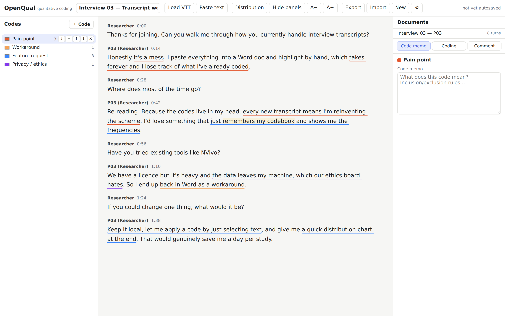

# OpenQual

A browser tool for qualitative coding of interview transcripts. It loads a Teams VTT
file or pasted text, lays it out by speaker, and lets you select spans of text, apply a
tree of codes and subcodes, attach comments, edit the transcript with codes staying put,
and export everything as JSON. The workflow follows f4analyse, but it runs entirely in
the browser.



## Running it

Open `index.html` over any static server. There is nothing to compile and no install
step; dependencies load from esm.sh at exact pinned versions. 

### From the repo folder, pick one:
```
python3 -m http.server 8000      # then open http://localhost:8000
npx serve                         # Node
php -S localhost:8000
```

Load `sample.vtt` from the
top bar to get a short two-speaker transcript to try.

Hosted copy: https://research.vidalion.co/openqual/

## Your data and backups

Everything is autosaved to your browser's `localStorage` and never leaves your machine.
That also means your work is tied to this one browser: clearing site data, using a
different browser or device, or private-browsing mode will lose it. **Use `Export` from
the top bar to download a `.json` backup** (and `Import` to restore it) — the app shows
an occasional, dismissible reminder to do so. Backups are also how you move a project
between machines. Deploying a new version of the site never touches your stored work.

## What works

- Teams VTT import, and a pasted-text path that sends rough text to an LLM and gets back
  speaker turns. Audio import is stubbed behind the same interface for later.
- A code tree you can create, rename, recolour, nest by dragging, reorder, and delete,
  with a memo on each code.
- Selecting text and applying codes. The same span can carry several codes; overlaps are
  drawn as stacked underlines rather than layered fills, so colours stay readable.
- Comments on a span, kept separate from code memos.
- Editing a turn's text. On save the codings inside that turn are remapped against a diff
  of the change. If an edit deletes a coded span entirely, the coding moves to an
  "unanchored" tray instead of disappearing.
- JSON export and import, plus an autosave to the browser's localStorage.
- A small distribution view: code counts and how often two codes land in the same turn.

## How it's put together

```
index.html   entry point
app.js       top bar, layout, keyboard shortcuts, floating toolbar/popover
store.js     state and actions, with a debounced autosave
model/       schema.js (validation), codings.js (overlap breakpoints), remap.js (diff + anchor remap)
ingest/      source.js (the common interface), vtt.js, text-llm.js, audio.js (stub)
ui/          h.js (Preact + htm), TranscriptView, CodeTree, ContextPanel, Settings, Distribution
io/          projectFile.js (JSON), refi.js and f4import.js (stubs for later)
```


## API keys

The pasted-text path needs an LLM key; VTT import does not. Keys are kept in the browser
only, in sessionStorage by default or localStorage if you pick that scope in Settings.
They are never written into the exported or autosaved project file.

The default provider is Anthropic (Claude), and you can point it at any
OpenAI-compatible endpoint instead, including a local model. Calls go straight from the
browser to the provider, which means the key is visible to that origin and the request
can be blocked by CORS. For anything beyond personal use, put the call behind a small
proxy that holds the key and point the endpoint field at it. The proxy is deliberately
not part of this repo.

## Not done yet

Audio import (Whisper plus Picovoice diarisation), seeking an audio element from a
timestamp, REFI-QDA export, f4analyse XML import, and merging two projects. The
interfaces and the offset/flatten helpers these need are stubbed in `ingest/audio.js`,
`io/refi.js`, and `io/f4import.js`.
